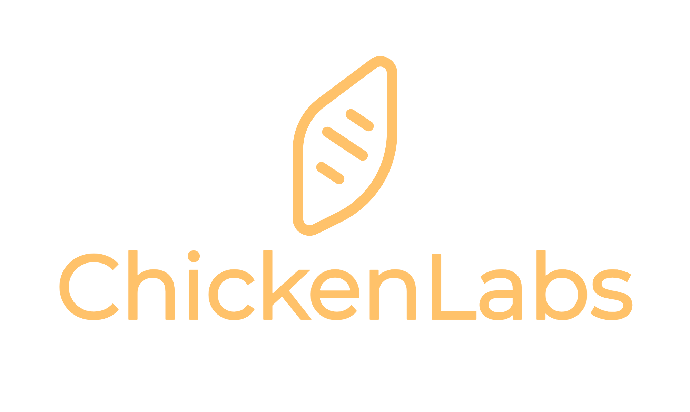

## 개요

ChickenLabs 서비스는 시중에 있는 다양한 브랜드의 닭가슴살 제품의 비교 분석을 도와줍니다.
그 동안 각 제품의 영양 성분을 일일이 비교하는 데 들었던 시간을 절약하고, 나에게 가장 적합한 닭가슴살을 쉽게 선택할 수 있습니다.

주소 : https://chicken-labs.vercel.app/

---

## 주요 기능

- 브랜드 필터: 선호하는 브랜드를 선택하여 해당 브랜드의 제품 정보만 필터링할 수 있습니다.
  

- 검색: 제품명이나 브랜드명으로 제품을 검색할 수 있습니다.
  

- 전체 평균 / 브랜드별 평균 영양성분 비교 
  : 전체 제품의 평균 영양성분 수치와, 선택한 브랜드의 평균 영양성분 수치를 비교할 수 있습니다.
  

- 선택한 브랜드 / 검색어에 따라 필터링된 모든 제품을 확인할 수 있습니다.
  

- 선택 제품 상세 비교 
  : 체크박스를 통해 제품을 선택하면 우측 표에서 더 상세히 비교할 수 있습니다. 
  : 단백질이 가장 높은 제품은 빨간색으로, 나머지 영양성분은 가장 낮은 제품이 파란색으로 표시됩니다. 
  : 화면 크기(1024px 기준)에 따라 반응해 비교 창이 우측 또는 하단에 위치합니다.
  
  

---

## 기술 스택

